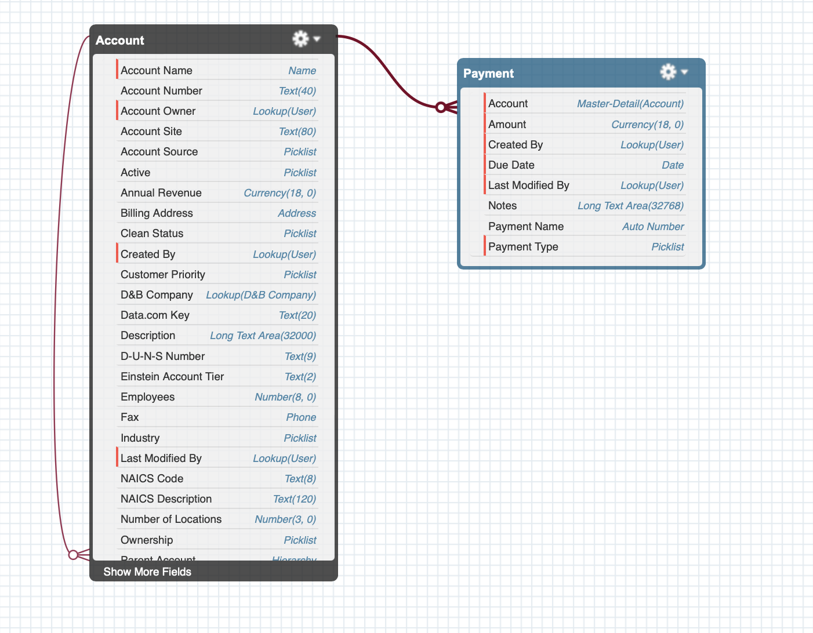

# Account Payments Management (LWC + Apex)

A Salesforce Lightning Web Component (LWC) that displays **Accounts** and their related **Payments**, allows creating new Payment records, and visualizes account payment activity using **Reports & Dashboards**.

This project was developed as part of the second phase of the **Junior Software Developer Task — CyanGate** technical assessment.

---

## Features

### **Lightning Web Component: AccountPayments**
- Lists all **Accounts** in the org.
- When an account is selected, lists all **Payments** related to that account.
- Dynamic form to create new Payments:
  - Payment Type (Picklist — Service, Product, Other)
  - Amount (Currency)
  - Due Date (Date)
  - Notes (Long Text)
- Inline validation & required field checks.
- Automatic refresh of the Payment list after creation.
- Toast notifications for success/error states.

### **Apex Controller**
- `AccountPaymentController.cls`
- Methods:
  - `getAccounts()` → returns Accounts
  - `getPayments(accountId)` → returns related Payments
  - `createPayment(paymentRecord)` → inserts new Payment with validation

### **Apex Test Class**
- `AccountPaymentController_Test.cls`
- Covers:
  - Happy path Payment creation
  - Creating Payment without Account (throws expected exception)
- **Test Coverage: ~95%+**

---

##  Custom Object Schema (Payment__c)

### Object Name  
**Payment (API: Payment__c)**

### Fields
| Field Label       | API Name            | Type                  | Required |
|------------------|---------------------|-----------------------|----------|
| Payment Type      | Payment_Type__c     | Picklist (Service, Product, Other) | ✔️ |
| Amount            | Amount__c           | Currency(18,0)        | ✔️ |
| Due Date          | Due_Date__c         | Date                  | ✔️ |
| Notes             | Notes__c            | Long Text Area        | ❌ |
| Account           | Account__c          | Master-Detail(Account)| ✔️ |
| Payment Name      | Name                | Auto Number (PAY-{0000}) | ✔️ |

### Relationship Type  
**Master-Detail (Account → Payment)**  
**Reasoning:**
- Payments should not exist without an Account.  
- When an Account is deleted, related Payments must also be deleted.  
- Provides roll-up summary support.  
- Fits real financial data integrity expectations.

---

## Schema Builder Screenshot

Below is the object schema showing the **Master-Detail relationship** between Account and Payment:

---

## Reports & Dashboards

### Report: Accounts with Payments Report
- Report Type:
  - **Accounts with Payments**
- Grouped By:
  - Payment Type  
  - Account Name
- Columns:
  - Payment Name  
  - Payment Type  
  - Amount  
  - Due Date  
  - Notes  
- Visualization:
  - Donut Chart → Sum of Amount by Account
  - Bar Chart → Sum of Amount by Payment Type

### Dashboard: Accounts with Payments Dashboard
Includes:
- Total Payments by Account (bar chart)
- Total Amount by Payment Type (donut chart)

- 

---

## 🧪 Test Coverage

| Class Name                        | Coverage |
|----------------------------------|----------|
| AccountPaymentController.cls      | ~91%     |

---
